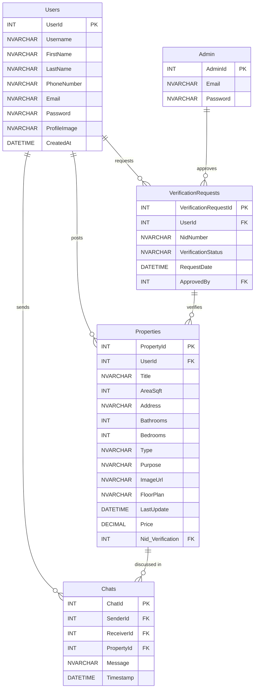

<div align="center">
  
  <h1><strong>Home Hut BD</strong></h1>

  <p>
    <a href="https://github.com/DittoOne/HomeHutBD/graphs/contributors">
    
    </a>
    <a href="https://github.com/DittoOne/HomeHutBD/commits/main">
    
    </a>
    <a href="https://github.com/DittoOne/HomeHutBD/issues">
    
    </a>
    <a href="https://github.com/DittoOne/HomeHutBD/stargazers">
    
    </a>
  </p>

</div>
  
# 🏠 HomeHutBD

An intelligent property listing and pricing platform powered by ASP.NET MVC and a Flask-based Machine Learning API. HomeHutBD lets users list properties, predict optimal pricing based on real estate data, and manage listings via a clean dashboard.


## 📚 Table of Contents

* [✨ Features](#-features)
* [📦 Tech Stack](#-tech-stack)
* [🚀 Getting Started](#-getting-started)
* [📁 Project Structure](#-project-structure)
* [🗂️ ER Diagram](#-er-diagram)
* [🤖 ML Model Details](#-ml-model-details)
* [🎥 Live Demo](#-live-demo)
* [👨‍💻 Team](#-team)
* [💬 Feedback](#-feedback)


## ✨ Features

* 🏠 Property listing with filters and images
* 📊 AI-powered price prediction using a trained ML model
* 🔐 User authentication & property ownership management
* 💾 SQL Server backend with scalable schema
* ⚙️ Batch script to auto-deploy Python Flask ML server
* 👨‍💻 Developer-ready with modular backend + frontend separation

## 📦 Tech Stack

* ASP.NET MVC (.NET Framework)
* SQL Server + SQL Server Management Studio
* Python 3.x
* Flask + scikit-learn (ML Model Serving)
* HTML/CSS + Razor Views
* Git & GitHub


## 🚀 Getting Started

### Prerequisites

Ensure the following are installed on your system:

* .NET Framework (compatible with ASP.NET MVC)
* Visual Studio (2022 or later recommended)
* SQL Server + SQL Server Management Studio
* Python 3.x (≥ 3.8)
* Git

> 💡 No need to manually install Python packages — the batch script will handle that automatically.


### 🔧 Installation Steps

1. Clone the Repository

```bash
git clone https://github.com/DittoOne/HomeHutBD.git
```

2. Set Up the ASP.NET MVC Project

* Open HomeHutBD.sln in Visual Studio
* Restore NuGet packages
* Build the solution

3. Configure the SQLExpress Database

* Open SQL Server Management Studio
* Create a new database
* Migrate the database or use sql codes of "dummy sql.txt" provided inside repository.

4. Set Up the Flask API

The ML model is powered by a local Flask server. A batch script automates everything.

From the root directory (HomeHutBD/), run:

```bash
setup_flask_environment.bat
```

This script will:

* Check/install Python if missing
* Create and activate a virtual environment under ./flask\_api/venv
* Install required packages: Flask, Flask-CORS, NumPy, Pandas, Joblib, scikit-learn
* Verify presence of the ML model file: best\_BD\_property\_price\_model.pkl


### 🖥️ Run the Application

1. Start the Flask API
   From the root directory, run:

```bash
setup_flask_environment.bat
```

2. Launch the ASP.NET MVC App

   * Open HomeHutBD.sln in Visual Studio
   * Press F5 or click Start

✅ Now you are good to go.


## 📁 Project Structure

<details>
<summary><strong>Click to expand file structure</strong></summary>

```
HomeHutBD/
├── wwwroot/
├── Controllers/
│   ├── AccountController.cs
│   ├── ChatController.cs
│   ├── HomeController.cs
│   ├── PredictionController.cs
│   └── PropertiesController.cs
├── Data/
│   └── ApplicationDbContext.cs
├── flask_api/
│   ├── app.py
│   ├── best_BD_property_price_model.pkl
│   ├── requirements.txt
│   └── venv/
├── Helpers/
│   └── SessionHelper.cs
├── Migrations/
├── Models/
│   ├── Admin.cs
│   ├── Chats.cs
│   ├── ErrorViewModel.cs
│   ├── Properties.cs
│   ├── PropertyPredictionModel.cs
│   ├── Users.cs
│   └── VerificationRequests.cs
├── Services/
│   └── FlaskServiceManager.cs
├── ViewModels/
├── Views/
│   ├── Account/
│   ├── Chat/
│   ├── Home/
│   ├── prediction/
│   ├── Properties/
│   └── Shared/
├── appsettings.json
├── Program.cs
└── setup_flask_environment.bat
```

</details>

---

## 🗂️ ER Diagram


<details>
<summary><strong>Click to expand ER Diagram</strong></summary>



</details>


## 🤖 ML Model Details

* 🧠 Model: scikit-learn trained model (.pkl)
* 📈 Input: area, location, bedrooms, etc.
* 💵 Output: Predicted price


## 🎥 Live Demo


* 🎦 [Demo Video](https://www.youtube.com/watch?v=your-demo-video)


## 👨‍💻 Team

| Name                        | LinkedIn                                                               |
| --------------------------- | ---------------------------------------------------------------------- |
| Md. Rakib Hasan             | [Profile](https://www.linkedin.com/in/afnanhasanrakib)                 |
| Md. Shahriar Rahman Bhuyian | [Profile](https://www.linkedin.com/in/shahriar-rahman-3893012a8/)      |
| Kazi Zannatul Tajrin        | [Profile](https://www.linkedin.com/in/kazi-zannatul-tajrin-76b835256/) |


## 💬 Feedback

If you have any feedback, suggestions, or want to collaborate — feel free to [open an issue](https://github.com/AfnanRakib/AUST-CODE-REALM/issues) or reach out via Linkedin.
